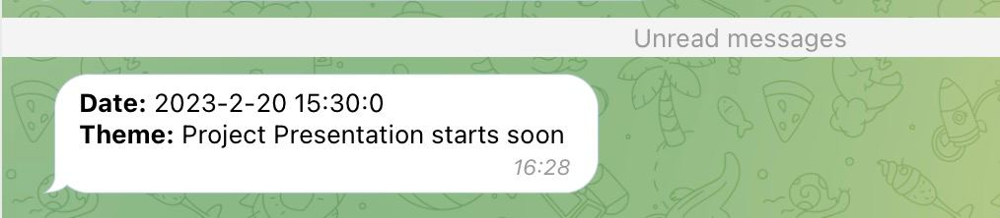

## Notify S21 bot 

### About
- This bot scans every 5 seconds your email folder for unseen messages and if it sees any - it sends you a msg in Telegram
- It is tested only on Yandex though.

### Prerequisites
- Docker

### Get ready to start your bot
1. Insert bot token in config.txt (make one from @botfather if you don't have it)
2. Insert your tg id in config.txt (you can get it from @getmyid_bot)
3. Insert your IMAP mail app password (make one if you don't have it)
4. Insert your IMAP username (search for an instruction at you email provider)
5. Insert your IMAP server (same)
6. Insert your folder to scan 

Don't use quotation marks. Just paste your data. Don't share with anyone your token or mail_pass.

### How to build
``docker compose up --build -d ``

### How to stop bot 
``docker compose down ``

### How it looks? 
 

### Bot is broken?
- Make an issue. Or pull request. I am a bit lazy about this project though, since that simple bot was initially made just for myself. But who knows!
